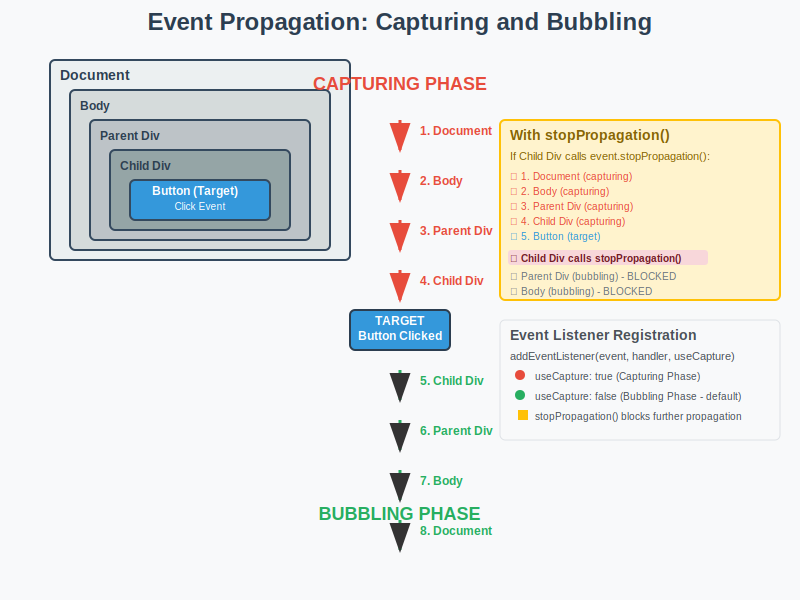

# Event Propagation: Complete Explanation



Event propagation in the DOM occurs in three phases when an event is triggered:

## 1. Capturing Phase 🔽

_(Red arrows, top-down)_

The event starts from the document root and travels down through the DOM tree to the target element. Event listeners registered with `useCapture: true` execute during this phase.

**Order:**

```
Document → Body → Parent Div → Child Div → Target
```

## 2. Target Phase 🎯

_(Blue box)_

The event reaches the actual target element where the event was triggered (the button in our example). Both capturing and bubbling listeners on the target element execute here.

## 3. Bubbling Phase 🔼

_(Green arrows, bottom-up)_

The event travels back up from the target element to the document root. Event listeners registered with `useCapture: false` (default) execute during this phase.

**Order:**

```
Target → Child Div → Parent Div → Body → Document
```

---

## Using stopPropagation()

When `event.stopPropagation()` is called in an event handler, it prevents the event from continuing its propagation journey:

```javascript
document.getElementById("child").addEventListener("click", (event) => {
  console.log("Child div clicked");
  event.stopPropagation(); // Stops here!
});
```

**Result:** The event stops at the child div and won't bubble up to parent, body, or document. However, the capturing phase still completes normally because `stopPropagation()` is called during the bubbling phase.

---

## Key Points 🔑

1. **Default behavior:**

   - Events bubble (`useCapture: false`)

2. **Execution order:**

   - Capturing listeners execute first, even on the target element

3. **stopPropagation():**

   - Prevents further propagation
   - Doesn't prevent other listeners on the same element

4. **stopImmediatePropagation():**

   - Stops propagation AND prevents other listeners on the same element

5. **preventDefault():**
   - Stops the default browser action
   - Doesn't affect propagation
   - Different from stopPropagation
