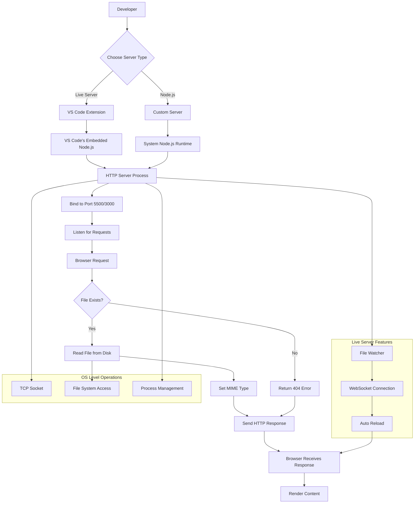

# Local Development Servers: Live Server vs Node.js

## Table of Contents
- [Overview](#overview)
- [Understanding File Access Methods](#understanding-file-access-methods)
- [Live Server Extension Deep Dive](#live-server-extension-deep-dive)
- [Node.js Server Implementation](#nodejs-server-implementation)
- [Server Flow Diagram](#server-flow-diagram)
- [Port Management](#port-management)
- [Comparison: Live Server vs Node.js](#comparison-live-server-vs-nodejs)
- [Best Practices](#best-practices)

## Overview

Local development servers are essential tools for web development that bridge the gap between static file access and production server environments. This document explains how these servers operate at the operating system level and provides practical examples.

## Understanding File Access Methods

### Method 1: Direct File Access (`file://`)

When you double-click an HTML file or open it directly in a browser:

```
file:///C:/Users/YourName/project/index.html
```

**What happens:**
- Browser reads the file directly from the filesystem using OS APIs
- No server involved - pure file system access
- No network protocols used
- Limited functionality due to browser security restrictions

**Limitations:**
- CORS (Cross-Origin Resource Sharing) restrictions
- `fetch()` API calls may fail
- Relative path issues
- No live reload capability
- Limited access to modern web APIs

### Method 2: HTTP Server Access (`http://`)

When using a local development server:

```
http://localhost:5500/index.html
```

**What happens:**
- A server process runs on your OS
- Files are served over HTTP protocol
- Browser makes network requests to localhost
- Full web functionality available

## Live Server Extension Deep Dive

### Architecture

Live Server is a VS Code extension that creates a local HTTP server using Node.js runtime embedded within VS Code.

### How It Works at OS Level

1. **Process Creation**: Live Server spawns a Node.js process
2. **Port Binding**: Binds to an available port (default: 5500)
3. **File Watching**: Monitors project files for changes
4. **WebSocket Integration**: Injects live reload scripts
5. **HTTP Serving**: Serves static files over HTTP protocol

### Key Features

- **Auto-reload**: Automatically refreshes browser on file changes
- **Port Management**: Automatically finds available ports
- **Multi-project Support**: Can serve multiple projects simultaneously
- **CORS Handling**: Properly configured for development

### Installation Requirements

```bash
# Live Server uses VS Code's embedded Node.js
# No separate Node.js installation required
```

## Node.js Server Implementation

### Basic HTTP Server

Create a simple server using Node.js:

```javascript
// server.js
const http = require('http');
const fs = require('fs');
const path = require('path');

const server = http.createServer((req, res) => {
    // Parse the requested file path
    let filePath = path.join(__dirname, req.url === '/' ? 'index.html' : req.url);
    
    // Get file extension for MIME type
    const extname = path.extname(filePath);
    let contentType = 'text/html';
    
    switch (extname) {
        case '.css':
            contentType = 'text/css';
            break;
        case '.js':
            contentType = 'text/javascript';
            break;
        case '.png':
            contentType = 'image/png';
            break;
        case '.jpg':
            contentType = 'image/jpg';
            break;
    }
    
    // Read and serve the file
    fs.readFile(filePath, (err, data) => {
        if (err) {
            res.writeHead(404, { 'Content-Type': 'text/plain' });
            res.end('File not found');
        } else {
            res.writeHead(200, { 'Content-Type': contentType });
            res.end(data);
        }
    });
});

const PORT = process.env.PORT || 3000;
server.listen(PORT, () => {
    console.log(`Server running on http://localhost:${PORT}`);
});
```

### Express.js Server (Enhanced)

```javascript
// express-server.js
const express = require('express');
const path = require('path');

const app = express();
const PORT = process.env.PORT || 3000;

// Serve static files
app.use(express.static(path.join(__dirname, 'public')));

// Handle SPA routing
app.get('*', (req, res) => {
    res.sendFile(path.join(__dirname, 'public', 'index.html'));
});

app.listen(PORT, () => {
    console.log(`Express server running on http://localhost:${PORT}`);
});
```

### Running the Server

```bash
# Install Node.js first (if not already installed)
node --version

# Run the server
node server.js
# or
node express-server.js
```

## Server Flow Diagram



## Port Management

### Live Server Port Allocation

When multiple HTML files are opened with Live Server:

1. **First Project**: `http://localhost:5500/`
2. **Second Project**: `http://localhost:5501/` (increments port)
3. **Third Project**: `http://localhost:5502/`

The `/001`, `/002` suffixes you might see are **internal session identifiers**, not separate ports.

### Port Conflict Resolution

```javascript
// Example port finding logic
const net = require('net');

function findAvailablePort(startPort = 5500) {
    return new Promise((resolve) => {
        const server = net.createServer();
        server.listen(startPort, () => {
            const port = server.address().port;
            server.close(() => resolve(port));
        });
        server.on('error', () => {
            resolve(findAvailablePort(startPort + 1));
        });
    });
}
```

## Comparison: Live Server vs Node.js

| Feature | Live Server | Node.js Server |
|---------|-------------|----------------|
| **Setup Complexity** | One-click activation | Requires coding |
| **Node.js Installation** | Not required (embedded) | Required separately |
| **Customization** | Limited options | Fully customizable |
| **Live Reload** | Built-in | Manual implementation |
| **Production Ready** | Development only | Can be production ready |
| **File Watching** | Automatic | Manual implementation |
| **CORS Handling** | Pre-configured | Manual configuration |
| **Multi-project** | Easy management | Requires port management |

## Best Practices

### For Live Server Usage

1. **Single Project Focus**: Use Live Server for individual project development
2. **Port Awareness**: Check which ports are in use (`netstat -an | grep :5500`)
3. **File Organization**: Keep project files well-organized for better serving
4. **Extension Updates**: Keep Live Server extension updated

### For Node.js Servers

1. **Environment Variables**: Use environment variables for configuration
2. **Error Handling**: Implement proper error handling and logging
3. **Security**: Never expose development servers to public networks
4. **Process Management**: Use process managers like PM2 for production
5. **Dependencies**: Keep dependencies updated and secure

### General Development

1. **Use HTTPS**: For testing modern web APIs that require secure contexts
2. **Port Documentation**: Document which ports your projects use
3. **Cleanup**: Stop unused servers to free up system resources
4. **Testing**: Test in multiple browsers and network conditions

## Conclusion

Understanding how local development servers work helps developers make informed decisions about their development environment. Live Server provides convenience and quick setup, while custom Node.js servers offer flexibility and production-readiness. Both approaches serve files over HTTP protocol, enabling full web development capabilities that direct file access cannot provide.

The key insight is that **any method involving `http://localhost`** requires a server process running on your operating system, whether it's VS Code's embedded Node.js (Live Server) or a standalone Node.js runtime (custom servers).